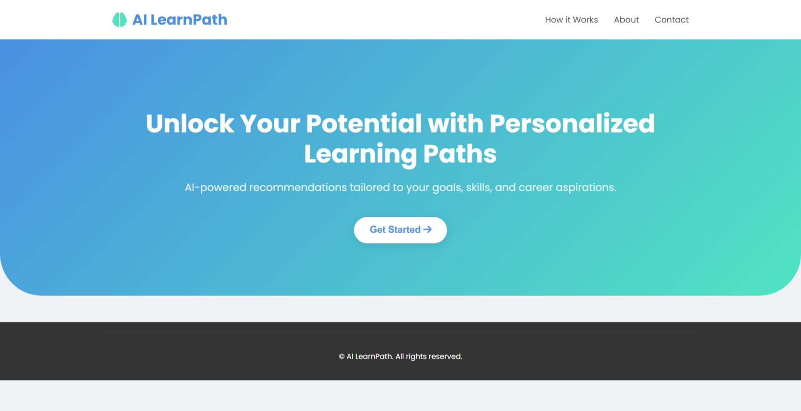
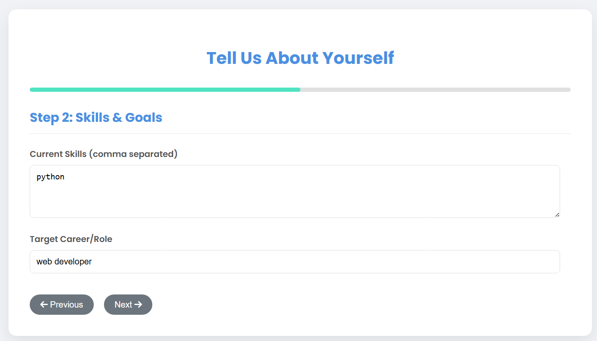
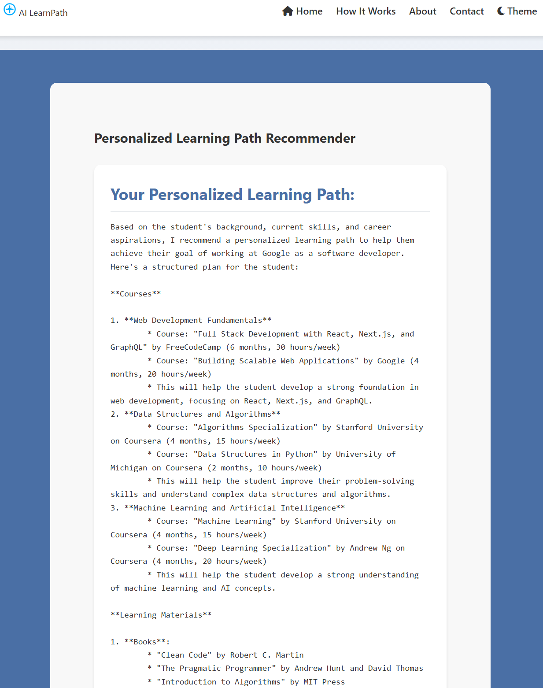

# Intelligent Course Recommendation Engine

This project is an educational platform that recommends personalized learning paths based on student goals, current skills, and career aspirations. The system uses the Groq API to generate tailored recommendations that adapt to each user's specific needs, with a fallback to local recommendation generation when the backend is unavailable.

## Recent Updates

- **Enhanced UI**: Improved visual consistency with CSS variables
- **Better Form Navigation**: Implemented multi-step form with progress indicator
- **Responsive Design**: Optimized for both desktop and mobile devices
- **Visual Improvements**: Added hover effects and better styling for recommendations
- **Bug Fixes**: Fixed various issues with form navigation and display

## Features

- Personalized course recommendations based on user profile
- Learning material suggestions tailored to career goals
- Skill development priorities with importance ratings
- Structured learning path with phases and milestones
- Responsive design that works on desktop and mobile devices
- Offline functionality with mock data when backend is unavailable

## Screenshots

### Homepage


### User Input Form


### Recommendations Output


## Setup Instructions

### Prerequisites

- A modern web browser (Chrome, Firefox, Safari, Edge)
- Node.js and npm installed on your machine
- Internet connection to access the Groq API

### Installation

1. Clone or download this repository to your local machine:
   ```
   git clone https://github.com/yourusername/intelligent-course-recommendation.git
   cd intelligent-course-recommendation
   ```
2. Navigate to the backend directory and install dependencies:
   ```
   cd backend
   npm install
   ```

### Running the Application

#### Without Backend (Works Offline)
1. Simply open `index.html` in your browser or use a local server:
   ```
   python -m http.server 3000
   ```
   Then visit `http://localhost:3000` in your browser
2. Fill out the form with your information
3. Click "Get Recommendations" to generate personalized learning paths
4. The application will automatically use mock data if the backend is unavailable

#### With Backend (Optional)
1. Set your Groq API key in `server.js` or as an environment variable:
   ```javascript
   // In server.js
   const GROQ_API_KEY = process.env.GROQ_API_KEY || 'your-api-key-here';
   ```
   Or using environment variables:
   ```bash
   # On Windows
   set GROQ_API_KEY=your-api-key-here
   
   # On macOS/Linux
   export GROQ_API_KEY=your-api-key-here
   ```
2. Start the backend server:
   ```
   cd backend
   npm start
   ```
3. In a separate terminal, start a web server in the project root:
   ```
   python -m http.server 3000
   ```
   Or use any other static file server
4. Visit `http://localhost:3000` in your browser
5. Fill out the form with your information
6. Click "Get Recommendations" to generate personalized learning paths

### API Key

To use the Groq API integration, you need to obtain an API key from [Groq](https://console.groq.com/):

1. Create an account on the Groq platform
2. Navigate to the API section in your dashboard
3. Generate a new API key
4. Set the API key in the backend server as described above

## How It Works

1. **Initial Interaction**: User clicks the "Get Started" button on the homepage
2. **Multi-step Form**:
   - Step 1: User enters personal information (name, education level)
   - Step 2: User provides skills and career goals
   - Step 3: User specifies learning preferences (time commitment, learning style)
3. **Data Processing**:
   - The application attempts to send this information to the Groq API via the backend server
   - If the backend is available, the Groq API uses a large language model to generate personalized recommendations
   - If the backend is unavailable, the application generates mock recommendations locally based on the user input
4. **Results Display**:
   - The recommendations are parsed and displayed in a user-friendly format
   - User can view their profile summary, recommended courses, learning materials, skill priorities, and a structured learning path
5. **Interactive Elements**:
   - Hover effects on recommendation items for better user engagement
   - Timeline visualization for the learning path
   - Option to start over and generate new recommendations

## Technologies Used

- **HTML5**: For semantic structure and content organization
- **CSS3**: For styling with CSS variables, animations, and responsive design
- **JavaScript**: For client-side interactivity, form validation, and API integration
- **Express.js**: For the backend server to handle API requests
- **Node.js**: For running the backend environment
- **Groq API**: For AI-powered learning path recommendations using LLM technology
- **Font Awesome**: For icons and visual elements
- **Google Fonts**: For typography with Poppins font family

## Example Data

The application is ready to use with any input data. Here's an example you can try:

- **Name**: John Doe
- **Current Skills**: JavaScript, HTML, CSS
- **Education Level**: Bachelor's Degree
- **Target Career**: Full Stack Developer
- **Weekly Time Commitment**: 15 hours
- **Preferred Learning Style**: Interactive

## Limitations

- The recommendations generated by the AI model should be reviewed by educational experts for critical learning decisions
- The Groq API-based recommendations require an internet connection and a running backend server
- Mock recommendations (used when backend is unavailable) are less personalized than those from the Groq API
- The Groq API has usage limits that may affect the availability of the service

## Future Improvements

- **User Authentication**: Implement user accounts to save and track learning progress
- **Course Integration**: Connect with actual course platforms (Coursera, Udemy, etc.) for direct enrollment
- **Feedback System**: Add rating and feedback mechanism to improve recommendations over time
- **Advanced Skill Assessment**: Implement detailed skill tests for more accurate personalization
- **Enhanced Offline Mode**: Improve the local recommendation algorithm with more sophisticated matching
- **Data Visualization**: Add charts and graphs to visualize learning progress and skill development
- **Mobile App**: Develop native mobile applications for iOS and Android
- **Social Features**: Add community elements like study groups and peer recommendations
- **Accessibility Improvements**: Ensure the application is fully accessible to users with disabilities
- **Internationalization**: Add support for multiple languages

## License

This project is available for educational purposes.

## Acknowledgements

- Groq for providing the API for AI-powered recommendations
- Font Awesome for the icons used in the interface