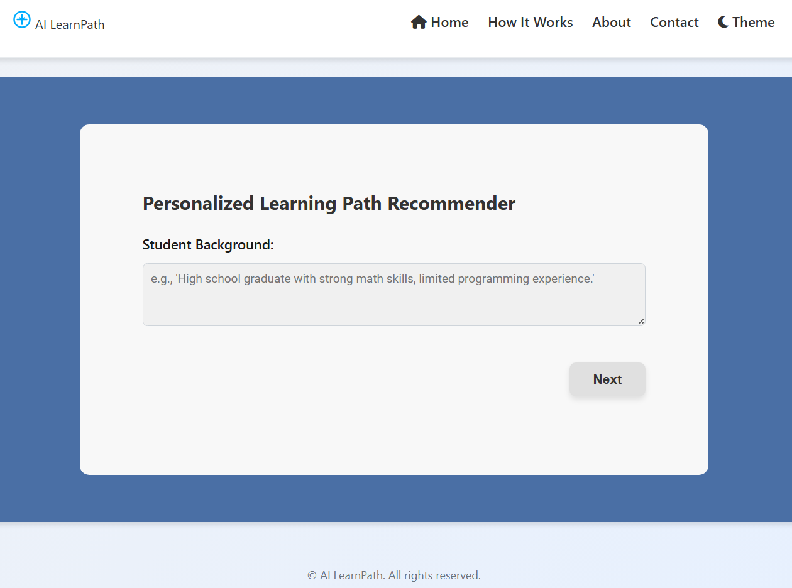
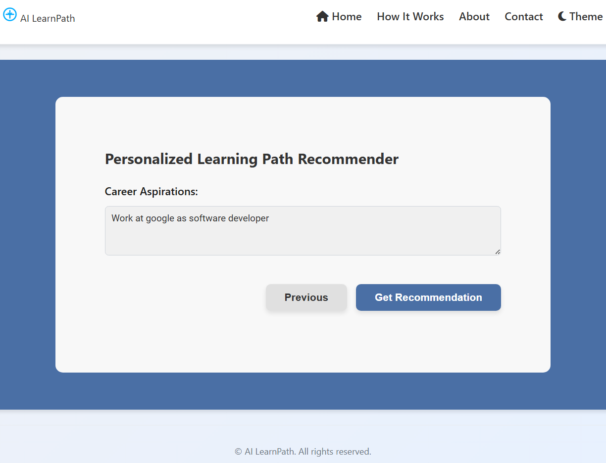

# AI LearnPath - Personalized Learning Path Recommender

AI LearnPath is an intelligent web application that generates personalized learning paths based on a user's background, current skills, and career aspirations. The application uses AI to recommend specific courses, learning materials, and skill development priorities tailored to each user's unique profile.

## Features

- **Personalized Recommendations**: Get customized learning paths based on your specific background, skills, and goals
- **Multi-step Form**: Easy-to-use interface with a step-by-step form to collect user information
- **Responsive Design**: Works seamlessly on desktop and mobile devices
- **Dark/Light Theme**: Toggle between dark and light themes based on your preference
- **How It Works Section**: Clear explanation of the recommendation process
- **Navigation Controls**: Back and home buttons for easy navigation

## Screenshots

### Home Page


### Input Form - Step 1


### Input Form - Step 2


### Recommendation Output


## Technology Stack

### Frontend
- HTML5
- CSS3 (with CSS variables for theming)
- JavaScript (Vanilla JS)
- Font Awesome (for icons)

### Backend
- Flask (Python web framework)
- Groq API (for AI-powered recommendations)
- Flask-CORS (for handling Cross-Origin Resource Sharing)

## Setup and Installation

### Prerequisites
- Python 3.7 or higher
- Node.js and npm (optional, for development tools)
- Groq API key

### Installation Steps

1. Clone the repository:
   ```bash
   git clone https://github.com/yourusername/rec-course-ai.git
   cd rec-course-ai
   ```

2. Create a virtual environment and activate it:
   ```bash
   python -m venv venv
   # On Windows
   venv\Scripts\activate
   # On macOS/Linux
   source venv/bin/activate
   ```

3. Install the required dependencies:
   ```bash
   pip install -r requirements.txt
   ```

4. Create a `.env` file in the root directory with your Groq API key:
   ```
   GROQ_API_KEY=your_groq_api_key_here
   ```

5. Start the backend server:
   ```bash
   python backend/app.py
   ```

6. Open the frontend in your browser:
   - Navigate to `frontend/index.html` in your file explorer and open it with your browser
   - Alternatively, you can use a simple HTTP server:
     ```bash
     # Using Python's built-in HTTP server
     cd frontend
     python -m http.server
     ```
     Then open `http://localhost:8000` in your browser

## Usage

1. Click on the "Get Started" button on the home page
2. Fill out the three-step form:
   - Step 1: Enter your educational background
   - Step 2: List your current skills
   - Step 3: Describe your career aspirations
3. Click "Get Recommendation" to receive your personalized learning path
4. Use the "Back" button to return to the form or "Start Over" to begin again

## Project Structure

```
├── .env                  # Environment variables
├── README.md             # Project documentation
├── backend/              # Backend Flask application
│   └── app.py            # Main Flask application file
├── frontend/             # Frontend web application
│   ├── index.html        # Main HTML file
│   ├── script.js         # JavaScript functionality
│   └── styles.css        # CSS styling
├── requirements.txt      # Python dependencies
└── screenshots/          # Application screenshots
    ├── home.png
    ├── input2.png
    ├── inputs1.png
    └── output.png
```

## Contributing

Contributions are welcome! Please feel free to submit a Pull Request.

## License

This project is licensed under the MIT License - see the LICENSE file for details.

## Acknowledgements

- [Groq](https://groq.com/) for providing the AI API
- [Flask](https://flask.palletsprojects.com/) for the backend framework
- [Font Awesome](https://fontawesome.com/) for the icons
